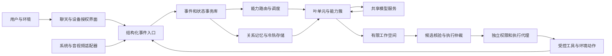

# SoCA架构与实施方案

版本：0.1，日期：2026-09-17。状态：**可实施设计基线，尚非已实现产品**。

来源：[概念层SoCA方案](认知联合体架构-AGI工程方案.md)、[研究基础与可行性评估](SoCA研究基础与工程可行性评估.md)。目标平台：Windows 11 x64优先，核心接口保留跨平台能力。本文中的数量、阈值和工期均为工程初值或验收目标，不是研究已经证明的最优值，也不是当前机器的实测结果。

## 1 结论与产品目标

**可以现在开始做覆盖SoCA全部职责的工程系统；不能据已有研究保证它成为AGI。**

本方案交付一个可感知、可对话、可使用受控工具、可记忆、可分组协作、可按资源伸缩的研究型认知系统。先取得稳定、可评估的单主体，再扩展多个主体。广义相对论或量子结构的未完成推导不阻塞它的经典软件实现。

对用户提出的问题，采用以下决定：

| 问题 | 本方案的选择 |
|---|---|
| 最小认知单元 | 有任务边界、持续状态、预测、受限决策、反馈更新与恢复能力的逻辑actor；不是一条prompt、一个神经元或一个LLM副本 |
| 分形整体 | 同一外部单元协议可包装叶单元或若干子单元；上层增加协调、关系和预算，不复制所有底层内容 |
| 需要几层 | L0–L7保留为8类功能职责；单主体默认3级组合深度，多主体时增加第4级。两种“层”不同 |
| 每层多少单元 | 标准试验配置：64个叶单元、8个能力簇、1个主体，合计73个逻辑单元；通常仅8–16个处于热态，不全部同时推理 |
| 硬件弹性 | 根据可用RAM、提交量、CPU、GPU、磁盘延迟与模型预算动态决定活跃集、并发与感知频率；不以硬盘容量无限增加并发 |
| 如何利用虚拟内存 | 使用64位地址空间、文件映射、共享只读权重和OS页缓存；冷单元由应用显式持久化并卸载，不把pagefile当记忆数据库 |
| 与大模型关系 | LLM是循环内可替换的推理/解释/生成服务。它提出假设和动作，不独占信念、记忆、权限、预算或执行权 |
| 与OS及多模态关系 | 经权限代理读取任务相关系统状态，用摄像头、麦克风、屏幕适配器感知，用扬声器和聊天界面交流；不默认全盘、全天候采集 |

第一版不承诺：自主产生正确长期目标、无需审批的任意系统操作、无界自我修改、永久不遗忘、最优资源分配或人类级开放世界泛化。没有设备的机器仍可只用聊天和结构化环境运行闭环。

## 2 不可混淆的四种对象

| 对象 | 持有什么 | 不等于什么 |
|---|---|---|
| 认知单元 | 身份、任务、状态、证据引用、策略版本、邮箱和预算 | 进程、线程、模型权重 |
| 模型服务 | 共享权重、分词器、推理队列、KV缓存、设备资源 | 某一个认知单元的私有大脑 |
| 记忆条目 | 事实、事件、技能、关系或摘要，带来源与有效期 | 必须常驻的活跃agent |
| 安全执行代理 | 能力令牌、目标约束、执行回执和恢复逻辑 | 一个“特别听话”的LLM角色 |

一个模型实例可服务许多单元，一个单元可调用多个不同模型和确定性算法；不为每条知识创建一个自主actor，也不为每个actor复制模型。不同用户的记忆、缓存及权限不得因共享模型而混合。

## 3 最小认知单元合同

### 3.1 逻辑定义

单元状态可记为

$$
U=(\mathrm{id},\mathrm{scope},\mathrm{goals},\mathrm{belief},\mathrm{memoryRefs},
\mathrm{modelVersions},\mathrm{capabilities},\mathrm{budget},\mathrm{pending},\mathrm{cursor}).
$$

这是经典软件状态，不假定qubit、全局密度矩阵或Kähler流形。复杂度应随具体任务增加，而不是每个单元强制同一维数。研究第191轮的8/24/32类是特定传感任务的状态数，不是本系统应有多少单元。

每个叶单元必须能完成一轮：收到事件→取证与更新局部信念→提出候选及其预期后果→请求允许的动作→等待新结果→比较预测与观测→更新可持久化状态。纯被动组件可以作为单元的工具，但没有这个合同的函数不标为完整主体。

单元“行动”可以只是申请新观测、提交带证据的候选或请求调用计算器；不要求每个单元都有OS写权限。“足够自主”指能完成自己的有限任务闭环，不意味着它单独拥有全部视觉、语言或规划能力。

### 3.2 建议持久化结构

```json
{
  "unit_id": "unit:file-summary:07",
  "kind": "leaf",
  "schema_version": 1,
  "scope": {"domain": "document-summary", "task_contract": "summary-v1"},
  "goal_refs": ["goal:42"],
  "belief_revision": 18,
  "belief_snapshot_ref": "blob:belief-18",
  "evidence_refs": ["obs:193", "tool-result:64"],
  "relation_refs": ["relation:source-lineage-8"],
  "strategy_version": "summary-policy-v1",
  "model_profile_ref": "profile:reasoning-local",
  "capability_policy_ref": "cap:read-selected-folder",
  "budget_ref": "budget:task-42",
  "pending_action_ids": [],
  "last_applied_sequence": 827,
  "state": "COLD"
}
```

快照中不存裸内存指针、活连接句柄、密钥、GPU指针或整个模型权重。模型的自评置信度不直接转成概率真值；belief中的概率字段必须注明预测对象、校准来源、模型版本、时间范围及`unknown`状态。

### 3.3 最小叶单元例子

“指定文件版本守望单元”只负责一个已授权目录：记录最近已处理的文件版本，预测下一次处理时内容是否仍一致；任务读取前检查文件版本，变化则请求重新读取，完成后提交`verified_summary`或`stale_source`。它持有事件游标、内容摘要引用和失效规则，必要时请求LLM，但不需要常驻LLM。

这个单元可以独立休眠与恢复；若恢复后发现文件被用户修改，必须重新感知，不能把旧快照当当前世界。这比“扮演文件专家”的prompt多出了真实状态、结果和生命周期。

## 4 分形结构与层数

### 4.1 功能层不是8级递归树

| SoCA职责 | 工程服务 | 是否每个叶单元各部署一套 |
|---|---|---|
| L0感知/行动总线 | Device Host、事件入口、Action Broker | 否，复用服务并按能力分权 |
| L1感知与世界模型 | 叶单元、结构化belief、确定性预测器 | 每单元有局部状态，模型服务共享 |
| L2工作空间 | 能力簇小黑板＋主体有限全局黑板 | 各组合边界有小空间，不无限复制 |
| L3候选竞争 | 有预算的生成、检验、选择工作流 | 按需启用，不是常驻全部候选 |
| L4执行/抑制/代谢 | 状态机、规则检查、调度器、执行代理 | 主体有预算仲裁，OS执行代理集中且不可绕过 |
| L5记忆 | 事务库、内容仓、检索、保留期与摘要 | 横切；按所有者和任务隔离 |
| L6动机与目标 | 受托目标栈、探索配额、人工审批 | 主体拥有目标，子目标受委托约束 |
| L7多主体社会 | 多完整内核、能力目录、临时队伍 | 第二阶段以后启用 |

### 4.2 推荐组合深度

| 组合级 | 含义 | 标准单主体配置 |
|---|---|---:|
| R0 | 叶认知单元 | 64个，按需加载 |
| R1 | 能力簇，统一对外任务合同 | 8个，每簇8个叶单元 |
| R2 | 完整主体内核 | 1个，协调8簇 |
| R3 | 可选多主体联合体 | 初始不部署；之后2–4个完整主体加轻量协调器 |

**默认分形深度为3，不是8；启用主体社会时为4。** 原SoCA“协作、竞争、轻量集中”是组织原则，不能直接换算成这几个数字。也不要求每层结构完全同构：叶单元做具体任务，上层额外处理分解、冲突、共享关系和资源仲裁。

每个父节点通常4–8个孩子，初始硬上限16。不是先填满一棵树；只有功能边界、责任和性能都需要时才拆分。实时感知链路不强制穿过所有层，仍必须经过权限代理和审计边界。禁止任务递归无限生成子任务，默认调用深度4、每任务最多32次单元激活，之后请求预算升级或返回部分结果。

复合单元对外暴露同一`observe/propose/predict/handle_result/snapshot`合同。父单元输出包含子结果、关系索引、冲突、未决条件和证据引用，不能只拼接子摘要或用多数意见覆盖矛盾。

### 4.3 64个叶单元的起始分配

| 能力簇 | 8个初始责任槽；它们可先由少量worker复用实现 |
|---|---|
| 交互与意图 | 对话轮次、语音转写确认、语言意图、任务边界、澄清、语音响应、打断控制、用户偏好 |
| 多模态感知 | 帧选择、视觉对象、OCR、场景差异、语音活动、声音事件、时序对齐、传感器质量 |
| 桌面与文件 | 系统资源、授权文件变化、文件版本、文档结构、授权窗口上下文、应用状态、动作前提、动作后验证 |
| 世界模型 | 实体、关系、事件时间线、局部预测、状态变化、因果假说、来源漂移、未知项追踪 |
| 推理与计划 | 检索、问题分解、逻辑/数学、候选方案、模拟、代价预测、依赖计划、停止/升级判断 |
| 证据与风险评估 | 来源核对、反方假设、代码/工具验证、冲突检测、概率校准、语义风险、隐私分类、失败复盘 |
| 记忆与学习 | 情景写入、语义候选、关系合并、TTL、去重、失效传播、技能回放、离线评估 |
| 任务协作 | 能力匹配、委托、进度、结果汇合、预算建议、取消传播、超时处理、交接恢复 |

表中的风险/预算单元只给建议，不能替代硬权限代理、系统调度器或用户。初期只实现首批有明确测试的单元，不让尚无实际逻辑的角色充数。冷库中的知识条目不计入这64个单元。

## 5 运行时拓扑与技术选择

建议延续原方案的Rust方向：Rust稳定工具链＋Tokio做核心；Windows API通过`windows`绑定封装；桌面用Tauri 2＋React/TypeScript，WebView2负责界面。Python仅作隔离的研究/模型worker，生产模型依赖使用独立锁定环境，不默认本研究的Python 3.14可兼容所有推理包。



| 进程/组件 | 职责 | 默认部署 |
|---|---|---|
| Desktop Host | 聊天、设备状态、审批、暂停、错误展示 | 1个桌面应用进程；WebView自身辅助进程另计 |
| Core | actor调度、状态机、工作空间、资源账 | 1个进程，协程承载逻辑单元 |
| Device Host | 摄像头、音频、屏幕与Windows遥测 | 1个受限用户态进程，设备按需开启 |
| Action Broker | 能力校验、OS动作、回执和幂等状态 | 独立进程；不是LLM插件内的一段可改prompt |
| Model Server | 本地LLM/VLM/ASR等推理队列 | 按模型家族0–2个起步，不按单元数启动 |
| Tool Worker | 不可信代码、格式解析、可取消长任务 | 小型受限worker池；任务退出可整树终止 |

可选本地LLM服务首选llama.cpp兼容接口；GPU推理或远端API放在同一个`ModelGateway`之后。ASR可用Whisper系本地引擎，TTS可先接系统语音；具体模型按语言质量、许可证、设备支持和实测资源选择。版本、权重哈希、许可证及推理配置进入模型清单。

初版核心不引入Kubernetes、Kafka、跨机CRDT或每actor一个容器。先用有界Tokio队列、SQLite WAL和命名管道；接口跨机后才考虑NATS/持久消息和服务发现。不要为未来“社会规模”提前增加运维负担。

### 5.1 未来代码模块边界

下列为建议的待创建项目布局，不代表当前仓库已经实现：

```text
soca/
  crates/contracts/       # 消息、版本和校验
  crates/core/            # actor、工作空间、闭环、资源调度
  crates/storage/         # 日志、快照、关系、删除与索引
  crates/model-gateway/   # 模型路由、缓存与上下文编译
  crates/os-broker/       # 授权、执行回执、幂等和风险分级
  crates/devices-win/     # Windows遥测、音视频和屏幕
  crates/eval/            # 重放、指标、故障注入
  apps/desktop/          # 聊天、授权、审批与状态
  workers/               # 隔离的模型或领域工具
  policies/              # 签名策略版本和测试
  scenarios/             # 可重复闭环任务与反例
```

## 6 一次完整认知循环

1. L0把用户输入或设备结果写成事件；原始内容与来源分开存，恶意页面/文档属于数据，不具有指令权限。
2. 路由器按任务、权限、来源和预算选择少数单元，先试确定性工具或已有技能，再决定是否调用LLM。
3. 单元读取授权证据，在动作前记录可检查的预测：对象、预计变化、时间窗、失败条件及不确定性。
4. L2验证候选结构与证据存在性；L3对重要结论做工具验证、反例测试或独立来源核验。低风险纯格式任务不强行编造反方观点。
5. L4比较代价与收益、保留未决冲突，给出明确动作意图或“需要更多信息”；错误代价高时提高证据门槛，不靠置信度投票绕过审批。
6. Action Broker再次检查能力令牌、用户批准、对象当前版本和资源额度；合法才执行，否则记录拒绝原因。
7. 执行回执不是世界真相。观察适配器读取实际结果，确认后置条件；若受外部变化影响则标记`inconclusive`。
8. 先比较旧预测与新观测，再更新belief与记忆。错误的引用、失败、超时、否决均保留在最小审计账中。
9. 有限预算内继续、回退、请求澄清或结束；结束后能力簇解散临时队伍，单元转温/冷态，计划外动作不继续后台执行。

**LLM每轮返回的是可校验产物，不要求也不存储模型内部隐式思维链。** 审计记录输入证据、公开简要理由、候选、校验结果、动作与观测即可。

## 7 消息、事实和执行合同

### 7.1 公共消息信封

所有消息至少包含：`event_id`、`schema_version`、`source_id`、`source_epoch`、`boot_id`、`source_sequence`、`task_id`、`causal_parent_ids`、`observed_at_utc`、`received_monotonic`、`provenance`、`payload_ref`、`permission_scope`、`data_class`、`expires_at`、`idempotency_key`。

同设备同epoch内用序列号和单调时钟排序；重启后不能直接比较不同boot的单调时间。跨设备/跨机保留时钟不确定性和因果引用，不按一个壁钟字段假定全局先后。ASR/OCR/VLM派生物指向原始事件及模型版本，不覆盖原始观测。

### 7.2 数据状态不偷换

| 类型 | 含义 | 可否直接触发OS副作用 |
|---|---|---|
| Observation | 某来源在某时刻的观测 | 否 |
| Hypothesis | 单元/LLM的解释，带支持、反对与未知项 | 否 |
| Prediction | 动作前可检查的预期结果 | 否 |
| ActionIntent | 参数、对象范围、预置条件、预期结果、风险和成本 | 否 |
| ExecutionPermit | 策略代理绑定具体动作参数与版本的短期授权 | 由受限执行代理消费 |
| ActionReceipt | 已提交、完成、失败或结果未知的事实记录 | 不等于后置条件验证成功 |
| OutcomeVerified | 新观测支持/否定预期结果 | 驱动下一轮，不自动追加新权限 |

引用必须能解析为存在且仍可访问的证据。缺失来源、过期证据、权限变化和数据撤回都可使候选失效。LLM输出看起来像系统消息也不能升级其信任等级。

### 7.3 副作用一致性

采用“每个单元单写者、可重放状态转移、至少一次消息＋幂等处理”，不承诺跨OS和外部系统的天然exactly-once。

ActionIntent、状态更新和待发送记录在一次SQLite事务中写入outbox；执行代理以动作ID去重。写文件优先临时文件＋同卷原子替换并核对目标版本。删除默认进入可恢复区；复制覆盖、外发消息等不可完全回滚操作需审批。

若进程在副作用后、回执前崩溃，状态为`UNKNOWN_COMMIT`；恢复时先查询目标状态，不能直接重发邮件、重复付款或再次覆盖。UI明确显示“结果未知，正在核对”。历史重放不重新执行外部动作，只读取已记录回执，另开显式恢复任务。

## 8 与LLM形成闭环，而不是外挂一层聊天壳

LLM在L1可解释多模态现象，在L3可提出方案/反方，在L4前可提出计划，在L5可提出摘要候选。它不是事实数据库，也不能同时充当最后的真实性裁判与权限批准者。

一次模型调用由上下文编译器提供：当前目标、可用证据引用、局部belief摘要、过去动作结果、能力范围、截止时间与输出Schema。模型返回候选后先解析和校验，再决定工具动作；工具结果作为新观测重新进入单元，因此**大模型就在感知–预测–行动–反馈的循环里面**。

关键边界：

- 状态、目标、证据、工具句柄和预算在Core与存储中，不仅在LLM上下文窗口里。
- 简单计算、文件版本、路径校验、统计和权限判断优先确定性工具；模型负责其擅长的语言、结构假设和计划生成。
- 同模型多样采样可增加候选多样性，但不能按独立证据计算可信度。核验尽量使用可执行检查或不同原始来源。
- 每次调用计tokens、延迟、设备占用、网络出站范围和费用。默认初轮最多4候选、2次反思循环、1个焦点议题；更高预算必须由调度器批准。
- 本地模型不可用时可以改用小模型、检索、规则或请求用户；**不因内存不足自动把私人数据发到云端**。
- 云端请求需单独策略批准并过滤敏感内容；记录服务商、模型版本和数据类别，密钥由系统凭据存储持有，不给LLM文本或普通单元快照。
- 界面显示暂缺证据与实际进度；模型超时、无效JSON或上下文溢出有确定性失败结果，不靠无限重试掩盖。

LLM服务共享权重但隔离会话KV缓存；只有经权限审查且输入完全相同的静态前缀才考虑复用。不同用户的隐私上下文、上传附件和会话缓存默认不共享。上下文压缩升级后用动作/结果回归，而非只看摘要相似度。

## 9 冷热单元、虚拟内存与持久化

### 9.1 应用决定“谁该工作”，OS决定“页此刻在哪”

| 层级 | 内容 | 驻留策略 |
|---|---|---|
| 控制核心 | 权限、取消、动作账、调度与最小索引 | 应用保持小型热工作集；不承诺OS绝不换出 |
| 热单元 | 当前任务状态、必要证据、活动邮箱 | RAM内对象，受容量和时间配额限制 |
| 温单元 | 可快速恢复的近期快照、索引页 | 序列化快照与OS文件缓存，按需映射 |
| 冷单元 | 长期状态、关系、事件游标、能力清单 | SSD/HDD上的事务元数据与内容对象，不保留活线程 |
| 模型层 | 大权重和可选适配器 | 独立共享服务；权重与KV/工作区分别计费 |

虚拟地址空间不是可免费使用的物理RAM；提交量需要后备资源。Windows工作集只表示当前驻留页，硬缺页可能从pagefile或映射文件读盘。把所有单元建成活进程再等待系统换页，会产生抖动、不可预测唤醒和大量隐式资源，不能代替本方案的冷单元机制。

`CreateFileMapping/MapViewOfFile`适合不可变大段、检索索引与只读模型权重的窗口访问；OS能按需调入并共享适当的文件页。但映射不等于零拷贝端到端：解密、解压、格式转换、GPU上传和后端权重重排都可能产生额外副本。

不使用pagefile保存可恢复业务状态，不调整用户pagefile设置，不默认提权或锁住大量内存。不要把`EmptyWorkingSet`或频繁强制GC当性能优化。一般应用只控制引用、缓存、队列和worker生命周期；保留OS调度余地。

### 9.2 单元生命周期

```text
COLD -> LOADING -> READY -> RUNNING -> WAITING
                     ^        |          |
                     |        +----------+
                     +-------------------+
READY/WAITING -> CHECKPOINTING -> COLD
任意状态 -> FAULTED / QUARANTINED
```

冷态只在注册表和持久邮箱中存在。收到相关事件时，路由器申请加载预算，合并同单元的并发唤醒请求，读取快照和游标后的事件，完成版本迁移与权限重验后进入READY。LOADING超时可取消，不阻塞前台聊天。

降温步骤：停止新租约→等待纯计算到安全点或取消→将pending动作、游标、状态和outbox事务提交→释放模型会话/KV及大对象→保留轻量路由元数据。存在不明副作用时由持久在线动作账继续核对，不以卸载单元“解决”它。

跨重启恢复的是语义状态，不是OS线程栈；不可恢复的socket、设备句柄和子进程必须按授权重建。迁移只改变执行位置，不许悄悄改变目标、模型版本、风险门槛或证据可见性。

### 9.3 初版存储选择

| 数据 | 默认存储 |
|---|---|
| 单元目录、目标、权限引用、动作状态、游标、事件元数据 | SQLite WAL，单机一个逻辑写入者，事务outbox |
| 事件与不可变内容大块 | 分段内容仓，按租户和数据类别隔离，元数据存内容引用、校验和与保留期 |
| 当前belief、单元快照、关系边 | 版本化结构对象；小项入事务库，大项引用内容仓 |
| 语义检索 | 先FTS5＋类型/时间/来源索引；证明需要后再加向量检索 |
| 模型权重 | 独立只读模型仓，权重哈希与许可证清单，全单元复用 |
| 密钥 | Windows Credential Manager/DPAPI保护的密钥材料，不存知识库 |

不把运行中的SQLite数据库放到网络共享供多机共同写；L7跨机时通过服务API管理所有权。向量库只存可重建索引，不能成为唯一的事实来源。

内容对象先写临时文件、完成校验和耐久化，再提交数据库引用；崩溃留下的孤儿对象由GC回收。已有引用指向缺失对象时返回可诊断缺失，不能伪造证据。SQLite同步级别、WAL检查点、磁盘缓存策略和备份恢复需经过断电/进程崩溃测试；只做一次内存映射flush不宣称实现事务耐久性。

对于加密数据，磁盘保存密文，解密页进入有上限的缓存；不能同时承诺任意加密压缩文件都能直接零拷贝mmap。按内容类型决定权衡，先正确再优化。

## 10 硬件弹性与明确数量

### 10.1 默认容量档位

以下为Windows单主体的**调优起点与上限**，不是必须创建这么多单元。数量由任务所需的有效能力决定，硬件只限制并发和驻留。

| 物理RAM | 叶单元上限 | 能力簇 | 主体 | 合计逻辑单元 | 建议热叶单元 | CPU计算任务并发上限 | LLM同时请求初值 |
|---:|---:|---:|---:|---:|---:|---:|---:|
| 8 GiB | 32 | 4，每簇8叶 | 1 | 37 | 4–8 | 2 | 1，小模型或用户许可的远端 |
| 16 GiB | 64 | 8，每簇8叶 | 1 | 73 | 8–16 | 4 | 1，剖析后最多2 |
| 32 GiB | 128 | 16，每簇8叶 | 1 | 145 | 16–32 | 8 | 1–2，视GPU/KV预算 |
| 64 GiB | 256 | 16，每簇16叶 | 1 | 273 | 32–64 | 16 | 2–4，需实测准入 |

CPU并发还要受物理核心数约束，不把async等待数当CPU并发。比如64 GiB但只有4个可用核心，不能照表运行16个CPU重任务。优先保证前台交互，后台任务使用更小上限。

启动最小闭环可只有8个叶单元和1个主体，不需要先做64个角色。标准73个逻辑单元也不意味着73个模型、73条线程或73个同时生成。后续多主体每个都有自己的预算和目标空间，但共享模型服务的总容量不能被重复分配。

### 10.2 一个可复算的RAM预算例子

| 总RAM档位 | SoCA RAM目标上限 | 共享模型CPU常驻预算 | 固定服务 | 检索/内容缓存 | 热状态缓存 | 瞬时任务、队列和复制余量 |
|---:|---:|---:|---:|---:|---:|---:|
| 8 | 4 | 1 | 0.75 | 0.5 | 0.25 | 1.5 |
| 16 | 8 | 4 | 1 | 1 | 0.5 | 1.5 |
| 32 | 18 | 10 | 1.5 | 2 | 1 | 3.5 |
| 64 | 40 | 24 | 2 | 4 | 2 | 8 |

单位GiB，每行分项之和等于SoCA目标。剩余RAM给OS、其他应用和安全余量；如果当前可用更少就下降档位。表不是某个模型能装下的承诺。ASR/VLM/LLM的共享CPU驻留都属于模型预算，不另开隐形池；GPU内存另设门槛，统一内存GPU会竞争系统RAM，不能重复当作独立容量。

例如1,000个热状态各128 KiB约125 MiB，但1,000个独立LLM上下文可能消耗数GiB甚至更多。冷单元可只有几KiB元数据和有限快照，却也需要索引、邮箱及磁盘。不要把“磁盘里可放十万个单元”解释为十万个独立智能模型随时无成本可用。

### 10.3 资源控制器

启动读取CPU拓扑、物理可用内存、系统提交量/上限、进程私有提交量与工作集、GPU预算和磁盘空间；不扫描私人文件来识别硬件。后台每秒取低成本状态，性能基准只在用户允许的空闲期运行。

设实测最近窗口单任务峰值新增RAM为m_peak、可分配任务RAM为B_task、可用核心预算为C_cpu：

$$
C_{\mathrm{heavy}}\le\min\{C_{\mathrm{cpu}},\lfloor B_{\mathrm{task}}/m_{\mathrm{peak}}\rfloor,C_{\mathrm{model}},C_{\mathrm{I/O}}\}.
$$

这只是一个上界，各模型混合任务还要逐项资源预约。新任务必须原子预留RAM、VRAM、tokens、I/O和deadline；完成、失败、取消均释放。预测与实测偏差更新下一轮预算，不能以过小预测冒险超售。

对本地模型，权重理论底限约为参数数×量化bit/8，但实际还含量化比例、后端副本和图工作区。KV缓存近似为 $2\times n_{layers}\times n_{kvheads}\times d_{head}\times n_{tokens}\times bytes$，再乘并发序列；GQA、量化、共享前缀和后端布局改变实际值，必须读取运行时统计或实测。不用权重文件大小代替推理峰值。

建议初始回压规则：系统可用RAM低于15%或提交占用高于80%持续5秒，停止扩容并减少后台并发；低于8%或提交占用高于90%立即停止后台推理、卸载非关键模型并保留审批/取消通路。恢复需可用RAM高于25%且提交占用低于70%持续30秒，逐级增加，避免来回抖动。阈值需在实际机器验证。

监测硬缺页率、磁盘队列、模型首token延迟和窗口响应，只有结合持续磁盘忙与交互退化才判定换页抖动。策略优先减少批量、上下文、视觉帧率、候选数和热缓存，再卸载模型；不自动关闭安全层或扩大云出站范围。

### 10.4 常驻与淘汰

按预计复用概率、任务优先级、唤醒成本、脏状态提交成本、字节占用和最后使用时间选择热集；采用分段LRU/准入分数配合滞后，避免只凭一次访问就把大对象全部装入。

冷单元唤醒默认并发2，预取预算不超过总I/O预算的10%；单元邮箱容量默认128，小消息信封不超过64 KiB，大载荷只传引用。感知流可合并过时状态、丢弃旧帧并写`GapEvent`；**不可静默丢弃用户命令、授权撤回、动作回执或审计提交**。这些流写不进去时停止新副作用，返回服务降级状态。

缓存上限不等于强制驻留保障：Windows仍可裁剪工作集。低延迟控制路径依赖小工作集、资源余量和故障回退，不依赖无限`VirtualLock`。共享映射页在多个进程RSS中可能重复出现，物理占用、私有提交和GPU分配分别计账。

## 11 多模态与底层OS接口

### 11.1 目标是尽量多的有效状态，不是无条件收集最多数据

所有源在`SensorRegistry`中声明可见范围、频率、保留期、用户授权和是否可发送给模型。默认本地处理；新增内容源须显式授权。传感器未获许可、断开或质量不足时输出“不可用/未知”，不伪装成“没有声音/没有人在场”。

| 需要 | Windows实现方向 | 默认频率/触发与边界 |
|---|---|---|
| RAM、提交量、进程资源 | GetPerformanceInfo、GlobalMemoryStatusEx、GetProcessMemoryInfo、Job记账 | 约1 Hz；优先本系统进程，不读取其他进程内存 |
| CPU、负载、磁盘、电源 | 系统性能计数器/PDH、GetSystemTimes、GetSystemPowerStatus、磁盘空间API | 1–5秒；高成本查询降频；未知传感器不猜测温度 |
| GPU可用预算 | DXGI预算/变化通知及推理后端统计 | 预算变化时；VRAM与共享内存分别标注 |
| 授权目录变化 | ReadDirectoryChangesW＋版本核对 | 仅用户选择根目录；缓冲溢出发缺口并重新扫描该范围 |
| 应用/界面状态 | Windows UI Automation、受限窗口信息 | 用户选择的应用或当前任务；不默认读取所有窗口文本 |
| 屏幕 | Windows.Graphics.Capture系统选择器 | 选定窗口/屏幕后按需；保留可见采集指示，不绕过受保护内容 |
| 摄像头 | MediaCapture或Media Foundation适配器 | 默认关闭；打开时可见指示；任务低频取帧，不把30fps全发VLM |
| 麦克风 | WASAPI/AudioGraph等用户态音频接口 | 默认按键说话；持续会话需明确开关与指示；实时本地VAD/ASR |
| 扬声器 | 系统TTS或经批准的本地TTS，经音频输出适配器播放 | 用户可暂停、静音、调音量、随时打断 |
| 聊天 | 本地桌面UI到Core的类型化事件 | 始终可用；能查看证据、取消任务、审批及纠错 |

初版无需自写内核驱动、拦截系统调用或获取管理员全局权限。WMI仅作补充配置查询，不在实时循环高频扫描全机。不同Windows版本、驱动、沙箱身份和打包方式的API可用性需特性检测并提供清晰降级。

不默认采集密码框、全局键盘输入、剪贴板、浏览器历史、凭据、其他账户内容、全部网络流量或后台摄像头。屏幕/麦克风得到的文字，即使像用户命令，也不能替代桌面明确授权；语音说话者身份不自动可信。

### 11.2 流媒体背压和对齐

摄像头原始帧进入有界ring buffer，默认只保留最新2帧及最多10秒临时引用；观察档可先取1 fps，事件触发短时提高，连续30fps只有指定任务需要且资源足够才启用。视觉编码器可本地处理较高帧率，LLM/VLM只收事件片段或关键帧。

按键说话时麦克风处理20–40 ms帧，本地VAD/ASR用独立实时队列。ASR有`partial/final`状态，部分转写不得直接触发有副作用动作。可选预录缓冲不超过5秒且需显式启用，默认不保存原始声音。

音视频使用设备时间戳、系统单调时间和校准偏差；模型延迟不能改变事件发生时间。传感器插拔或流重建使旧序列终止，新序列重新标定。多模态“看见同一物体”和“听到相关语句”是有置信范围的绑定假设，不只按接收时间相近就断言因果。

输出语音记录`origin=self`、播放区间和输出ID；回声抑制、说话期间的打断规则避免系统把自己的声音当新的用户命令。扬声器播放不是用户同意的证据。

## 12 OS动作、权限与隐私

### 12.1 动作等级

| 等级 | 示例 | 放行要求 |
|---|---|---|
| A0 | 本地计算、查询本系统状态、输出聊天草稿 | 已有任务范围与预算即可 |
| A1 | 读取已选文件、授权窗口、开启一次已批准采集会话 | 范围限定授权，撤回立即生效 |
| A2 | 在指定目录生成/重命名文件、修改应用数据 | 预览、目标版本核对、备份/撤销或每任务明确批准 |
| A3 | 对外发送、安装软件、修改全局设置、大量删除、财务或账户动作 | 每动作人工审批；首版禁止其中高风险类别 |
| A4 | 提权、修改自身政策/凭据、规避审计或扩大传感权限 | 普通认知循环无此能力，走用户独立管理流程 |

默认不是“能访问底层就能执行所有底层动作”。全局暂停应先撤销尚未消费的执行授权、停止采集和外发，再取消模型任务；已发生副作用只能核对、补偿或由用户处理，不能承诺倒转现实。

### 12.2 执行代理检查点

能力令牌绑定用户/主体、具体工具、资源范围、参数摘要、允许次数、TTL、预算、策略版本及审批ID。授权不给子单元自动扩大；将任务转给其他主体须重新验证委托链。

文件操作解析最终目标，检查目录边界、junction/symlink/reparse point、文件身份与版本；在打开句柄后的执行点再核验，避免先检查路径后被替换。URL按协议、域和实际目标出站策略检查；下载内容与网页文字不具有执行权。

工具不接收任意拼接shell字符串作为默认接口；优先结构化参数和明确应用API。需要运行不可信代码时，使用受限令牌/AppContainer或更强隔离，禁止环境凭据与网络继承。Windows Job Object负责进程树资源与终止，**它本身不是安全沙箱**；同一用户权限下的恶意进程也不应被视为已隔离。

本机Core/Broker通信使用按用户身份配置ACL的命名管道和握手；任何本地HTTP推理端口只绑定loopback，带每会话认证和来源检查，不把“本机地址”当作无需授权。第三方MCP工具同样经Broker封装，协议支持工具调用不等于工具已可信。

Broker故障、策略不可读、审计写失败、磁盘满或审批过期时，默认拒绝新副作用。确定性规则管边界，LLM可以辅助识别风险但不能放宽规则。

### 12.3 记忆保留与删除

| 数据 | 第一版默认 |
|---|---|
| 原始摄像头/屏幕帧 | 不持久化；短时RAM缓冲。用户显式保存的片段另有保留期 |
| 原始音频 | 默认不落盘；会话结束释放缓冲 |
| 对话与转写 | 本地可配置保留，初值7天；用户可随时删除或关闭历史 |
| 授权文件派生索引 | 引用源版本；撤销目录权限后立即不可检索，随后清理 |
| 长期偏好/语义事实 | 只有明确需记忆的内容才提升，保存来源、范围与可删除入口 |
| 操作审计 | 初值30天的最小元数据；不保存密码、完整prompt或无限个人内容 |

append-only指保留期内的事件追加语义，不等于永久不可删除。撤回权限或删除个人数据时，传播到快照、摘要、向量索引、模型会话缓存和备份保留计划。先写tombstone使查询立即不可见，再异步清理，并给用户完成状态。

审计完整性可用事件序列、HMAC链和外部检查点检测篡改；没有外部信任根时不能承诺管理员也无法篡改。密码学擦除需要所有密钥副本与备份政策同时处理，不能承诺SSD物理残留必然即时消失。

## 13 工作空间、学习和社会层

### 13.1 工作空间的拥塞控制

一个主体默认一个当前焦点、最多8个待核验正式候选。每个能力簇先合并重复来源，再向上提交。重要反对证据保留，低价值重复提案可合并；拒绝有原因和可重试条件。原始事件不等于每条都进LLM上下文。

焦点评分使用任务相关度、预期收益、证据新颖度、截止期、风险及资源成本。只以surprise最大化会反复追逐噪声，因此探索受用户目标和配额限制。无法验证收益时返回不确定或提出更便宜的观测，不无限增加agent数量。

### 13.2 学习分为三种，不混为“自我进化”

1. 状态学习：每轮根据实际结果更新belief和校准，立即可用但可撤销。
2. 记忆/策略改进：摘要、规则和技能作为候选，经回放与保留任务集检验后版本化启用；不覆盖原证据。
3. 权重训练：后续离线流程，数据同意、许可证、独立评估、回归和回滚齐备后才上线；首版不在线修改主LLM权重。

新单元、子目标和候选策略必须经过准入。系统可建议新的单元或拓扑，但没有自行安装可执行代码、修改签名策略或提高权限的能力。后台巩固只在显式启用、设备空闲且预算足够时运行，电池低或用户活动时暂停。

### 13.3 多主体与分布式部署

先区分“逻辑分布式”和“跨机器分布式”。第一版一个机器内多个独立actor，不要求网络集群。以后每主体拥有自己的完整目标、belief、邮箱、权限及记忆域，任务队伍临时组成；共享的是经授权的知识包与证据引用，不是任意私有状态。

一个对象仅有一个当前写入所有者，用版本和租约避免双主；动作网关要求fencing token。网络分区时不允许两个主体都继续执行同一外部副作用。黑板可以复制读视图，但权限撤销和动作提交不能用“最终一致就好”处理。

跨机使用认证传输、主体身份、数据范围和出站审计；共享知识记入传输、验证与索引成本。先验证2主体、再4主体；同预算下没有收益就不扩群体。社会协调器不能覆盖底层安全代理或用户拒绝。

## 14 用户可见的桌面体验

首屏是可用的聊天与任务状态，不做介绍性落地页。文字输入始终可用，语音是可选输入；用户可查看摄像头/麦克风/屏幕各自是否开启、采集对象、隐私模式和本地/云模型状态。

至少提供：任务取消、全局暂停、立即静音、采集开关、权限列表、待审批动作预览、来源链接、记忆查询/删除、资源占用、失败与恢复状态。用户说“记错了”生成纠错事件并失效相关派生记忆，不只在下一条回复中口头道歉。

LLM不可用时仍能关闭设备、撤销授权、查看动作账和退出程序。前台渲染、权限按钮和实时音频不排在慢推理队列后面。

初版中文为主；ASR识别不确定时展示转写并允许修改，尤其是路径、姓名、数量与危险动作。对外发送和高风险操作必须通过有明确目标的图形审批，不以可能误识别的语音自动批准。

## 15 典型端到端任务

例子：用户在聊天或按键语音中说“把我选的资料目录整理成一份摘要，保存前让我看”。

1. UI选择目录并生成范围授权；语音必须得到最终转写，歧义先澄清。
2. 文件单元读取授权文件的版本；事件账记录来源，摘要单元请求少量相关事实。
3. LLM依据这些内容生成带引用草稿；核验单元检查引用存在、数字来源和遗漏，不能把文件中的提示注入当新系统指令。
4. 预测单元记录计划写入的文件名、内容摘要和版本前提；Executive提交ActionIntent。
5. Broker显示预览，等待用户批准。在此期间，相关单元可温存；文件已变化则失效草稿并重新核验。
6. 批准后在授权目录创建文件，记录动作回执，再重新读取已生成文件核对哈希/内容与目标。
7. UI显示完成或失败；只保存授权的任务摘要和必要审计。闲置单元checkpoint后休眠，共享LLM可由其他任务继续使用。

这个任务同时验证最小单元、组合、LLM在环、OS权限、读后验证、冷热驻留与恢复；不是“一个大prompt调用多个工具”就算完成。

## 16 实施路线与退出条件

时间仅作规划估计：假设2名系统/应用工程师、1名模型与评估工程师，另有兼职安全与测试支持，复用现成模型。独立开发通常更久；不把日期当效果保证。

| 阶段 | 工作包 | 产物和进入下一阶段的门槛 | 估计 |
|---|---|---|---|
| P0 合同与测试环境 | Schema、事件/动作状态机、模拟OS、规则策略、旧研究反例转成案例 | 冻结最小消息版本；能重放“请求≠执行≠验证”的轨迹 | 1–2周 |
| P1 单主体文字闭环 | 8叶＋1主体、聊天、共享模型网关、只读选定目录 | 在模拟和只读任务中完整闭环，所有关键字段可审计 | 2–3周 |
| P2 可恢复与弹性 | SQLite/outbox、快照、冷热调度、取消和资源门槛 | 故障重启不重复副作用，内存压力下降档，冷恢复通过 | 3–4周 |
| P3 多模态与受限写入 | 摄像头、按键语音、TTS、选窗、审批写文件 | 撤权/断连/静音可用；无暗中采集，后置条件真实验证 | 3–4周 |
| P4 单主体完整职责 | 4–8能力簇、目标栈、证据谱系、巩固和长期评估 | 等预算对照显示净收益，否则简化架构；通过长时与隐私测试 | 4–6周 |
| P5 多主体及离线学习 | 2–4主体、委托、跨机可选、技能/模型版本升级 | 故障隔离、分区恢复、权限隔离及升级回滚通过 | 再4–8周 |

P0–P4约13–19周是可验证单主体试验系统的预算，不是AGI工期。L7和权重训练在前面的运行时正确性与评价基线完成后再做。

第一批具体任务按顺序为：合同schema和validator；带outbox的事件/动作存储；确定性闭环测试；单元生命周期；ModelGateway；聊天UI；审批Broker；目录读取；冷恢复；资源控制；最后接音视频。测试和权限不放到“功能做完以后”。

## 17 验收与科学上不夸大的比较

所有目标在固定测试机器、固定模型哈希、同任务、同时间/token预算下测量。以下数字是首轮建议门槛，不是已经达到的成绩。

| 类别 | 建议验收 |
|---|---|
| 闭环正确性 | 100个确定性模拟任务的预测先于动作、动作实际结果后验检查及错误先记录后更新全部通过 |
| 执行边界 | 明确越权、撤权、过期授权、改参数、路径逃逸和prompt注入案例均不能绕过Broker；测试通过不称全球安全证明 |
| 崩溃恢复 | 至少100个故障注入点，覆盖意图前/后、执行后回执前、快照提交前/后；已提交副作用不因重放重复执行 |
| 弹性 | 人为降低可用内存、GPU OOM、磁盘忙时，停止后台扩容并保持取消/审批可响应；记录峰值私有提交及工作集，不只看平均值 |
| 冷恢复 | 目标NVMe机器上64 KiB轻量单元状态的p95恢复≤200 ms；模型冷加载单独计时且可取消，不混入此指标 |
| 前台与语音 | UI本地反馈p95≤100 ms；撤销采集令牌立即拒绝新数据，适配器目标1秒内停止并清理队列；TTS打断目标≤250 ms |
| 功能收益 | 至少50个授权桌面任务＋独立保留集；与同模型单agent、无记忆、无候选竞争版本做等预算比较，报告成功率、代价、人工介入及失败类型 |
| 记忆效用 | 恢复、摘要和压缩前后比较后续任务收益及动作变化；同时测试过期证据、同源重复、关系丢失和删除传播 |
| 多模态 | 摄像头拔出、麦克风拒权、ASR错字、回声、屏幕尺寸变化、时钟偏差、帧丢失均可诊断并降级 |
| 长期运行 | 先8小时后24小时试运行，内存和日志增长符合配额，后台无目标任务可停，用户能删除记忆并保持安全审计最小化 |
| 多主体 | 与单主体等预算比较；分区、主体故障和重复消息不造成双写或权限串用 |

公开报告失败、超时、拒绝和遗漏，不仅展示成功演示。概率校准看Brier/ECE等适用指标并标注样本范围，不能把一份prompt中的“90%置信”当经过校准的分布。

现有认知研究此次定向复跑的39项检查只支持若干基础合同，不替代上述桌面系统验收。完整SoCA实现后仍需持续评估，规模增长没有自动提高智能的保证。

## 18 一组明确的架构决策

| 决策 | 默认选择 | 何时重新评估 |
|---|---|---|
| 单元实现 | 轻量actor＋任务状态，不绑定模型副本 | 出现真实故障隔离或硬实时要求时拆进程 |
| 默认组合 | 3级，64叶/8簇/1主体的标准上限 | 任务图、资源和对照实验支持改变时 |
| 记忆表示 | 经典结构状态＋来源关系，不模拟量子全态 | 某个明确定义任务证明其他表示有净收益时 |
| 真相来源 | 原始可核验证据与实际结果，不是黑板多数 | 仍保持来源和版本，不用声誉替代事实 |
| 大模型 | 循环内共享服务，非执行权拥有者 | 可换模型，但策略权限边界不随之放宽 |
| 驻留 | 应用休眠＋OS页缓存，显式预算 | 真实剖析显示某类状态适合不同后端时 |
| 分布式 | 先单机正确，再2–4主体/跨机 | 单机瓶颈已量化且迁移收益超过成本时 |
| 自我改进 | 可回滚数据与策略候选，离线训练 | 有独立保留测试、批准及风险资源后 |
| OS权限 | 用户态最小权限，执行代理最后把关 | 确有具体需求时由用户独立授权，不由模型自行提权 |

本方案刻意允许失败后的简化：如果多候选、更多单元或更深层次没有等预算收益，就减少它们。SoCA的工程目标是稳定的认知闭环和可验证效用，不是把树画得足够复杂。

## 19 研究与平台依据

研究依据及其适用边界集中在[可行性评估](SoCA研究基础与工程可行性评估.md)，尤其是[任务充分状态](research_cognition_physics/research_note_191.md)、[策略变化误差](research_cognition_physics/research_note_203.md)和[整体资源账](research_cognition_physics/research_note_205.md)。软件设计是这些约束的工程转译，不引用量子模型常数作为RAM或agent最优数。

Windows实现依据：

- [Virtual Address Space](https://learn.microsoft.com/en-us/windows/win32/memory/virtual-address-space)：虚拟地址与物理页不同。
- [Working Set](https://learn.microsoft.com/en-us/windows/win32/memory/working-set)：驻留、软/硬缺页和系统裁剪。
- [File Mapping](https://learn.microsoft.com/en-us/windows/win32/memory/file-mapping)：文件视图、按需映射与共享访问；业务一致性仍需应用协议。
- [GetPerformanceInfo](https://learn.microsoft.com/en-us/windows/win32/api/psapi/nf-psapi-getperformanceinfo)：系统物理与提交资源指标入口。
- [Job Objects](https://learn.microsoft.com/en-us/windows/win32/procthread/job-objects)：进程树资源管理与终止，安全限制仍需进程级实施。
- [Windows.Graphics.Capture](https://learn.microsoft.com/en-us/windows/uwp/audio-video-camera/screen-capture)：用户选择目标、可见采集提示和设备能力检测。

本次仅编写和校验架构文档、回顾研究并定向复跑基础测试。没有启动摄像头/麦克风、抓取屏幕、读取私人系统内容、安装模型或创建后台服务。