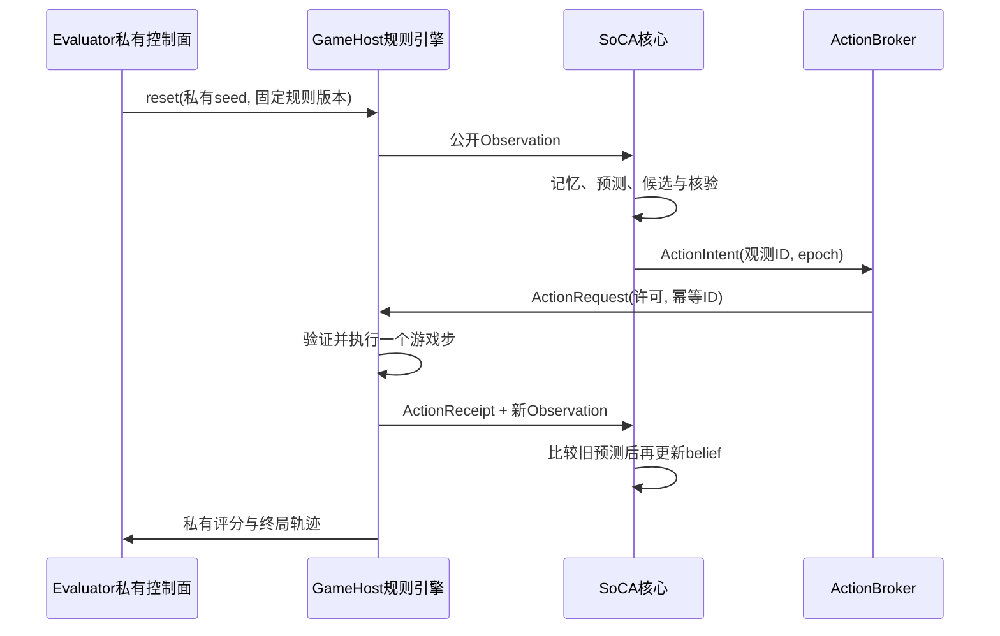

# SoCA工程实施规格：自动拓扑伸缩与认知游戏

版本：0.2，日期：2026-09-17。读者：负责Core、存储、模型、桌面和测试的开发工程师。

承接[主架构方案](SoCA架构与实施方案.md)，本规格细化并替代其中“只按硬件档位给固定单元上限”的部分。**当前交付是设计、协议和可执行参考规划器，不是已经运行的SoCA、迷宫或扫雷应用。** 不要求继续物理构造研究才能开工。

## 1 开工范围与明确决定

本迭代交付两个能连接的功能：

1. `TopologyController`根据当前可分配硬件资源和待处理任务，计算每层参与拓扑的单元数量，执行有版本、可回滚的拆分/合并/休眠。
2. `GameHost`运行专门的认知测试游戏。SoCA通过与桌面任务相同的观察→预测→候选→批准→动作→反馈循环进入游戏，不开一个绕过Core的专用LLM脚本。

第一批游戏是迷宫和扫雷，先结构化部分观测，再增加像素观测赛道。系统自适应能力和游戏认知能力分别评分；高胜率不等于AGI。

已有可执行规格：

- [拓扑规划器](soca_reference/topology.py)：只用标准库，输入资源包络，输出各层数量；无副作用。
- [拓扑参考测试](soca_reference/test_topology.py)：资源不足、同需求异硬件、GPU/云权限、层级总数、伸缩滞后等13项测试。
- [游戏公开消息Schema](soca_reference/game-protocol.schema.json)：JSON Schema 2020-12，定义观测、动作请求和回执，不包含隐藏世界状态。
- [Schema结构测试](soca_reference/test_game_schema.py)：5项检查覆盖本地引用、封闭字段、动作集合与像素/符号分离，不替代生产Schema验证器。

参考代码是移植到Rust的行为基线，不要求生产Core调用Python规划器。游戏规则引擎另用成熟库，不能用这个JSON Schema替代游戏逻辑。

## 2 “伸缩”究竟改变哪些数量

同时维护三个不同计数，不允许混成“agent数量”：

| 计数 | 含义 | 扩缩方式 |
|---|---|---|
| catalog_count | 已注册身份、模板、可恢复冷单元总量 | 受磁盘、索引和人工策略限制；缩容不自动删除历史 |
| topology_count | 当前主体参与路由和任务分解的单元槽数 | 自动拆分/合并/撤出租约，**本次新增控制的重点** |
| hot_count / running_count | 驻留状态数 / 正在工作的任务数 | 短周期换入换出和并发控制，与拓扑解耦 |

例如拓扑从64叶缩到16叶：不是64个单元仍都参与路由、只减少线程，而是48个槽退出当前路由，状态进入冷目录；兼容职责由剩余单元接管。归档事实、未决动作和各单元身份仍保存。后续扩容可重新激活旧身份，不按新空白单元丢掉经验。

不因空闲RAM多就生成无任务角色；硬件决定可承载上限，任务需求决定实际申请多少槽。模型权重仍共享，扩叶数不自动复制模型进程。

## 3 各层自动计数规则

### 3.1 功能L层与组合R层仍分开

L0–L7职责不随硬件消失；数量变化的是承载这些职责的actor和worker。采用以下组合树：

| 层 | 默认计数函数 | 是否可以硬件驱动自动调整 |
|---|---|---|
| R0叶槽 | 从8、16、32、64、128、256、512选择 | 是，按本规格预算和需求 |
| R1能力簇 | `ceil(R0 / 8)` | 是；不足一簇也允许，不制造虚假叶单元 |
| R1b中间协调层 | R1≤16时为0；否则`ceil(R1 / 8)` | 是，超扇出时插入，缩小时折叠 |
| R2当前用户主体 | 1 | **身份不自动分裂或合并**；资源不足时暂停工作而非删除主体 |
| R3社会工作槽 | 默认0；明确启用L7后0–4个已有/获准模板主体 | 硬件可调整同时激活数，但不自动创建新权限域或融合人格/私有记忆 |

本次可执行规划器覆盖**单主体R0、R1、R1b、R2**；R3需要在P5独立实现并验收，不能把参考代码描述为已支持跨机社会伸缩。L7调度器必须先预留多个主体共享的模型预算，再对子主体运行规划，不能每个主体都拿到整机资源包络。

### 3.2 拓扑档位

每簇目标8叶，根最大16个直属孩子；R1b存在时每个中间协调器最多8簇。计数是能力槽上限，模块包提供足够不同职责/分片才可实例化。

| Profile | R0 | R1 | R1b | R2 | Total | Depth | Hot Leaves | Heavy Workers |
|---|---:|---:|---:|---:|---:|---:|---:|---:|
| T0 | 8 | 1 | 0 | 1 | 10 | 3 | 2 | 1 |
| T1 | 16 | 2 | 0 | 1 | 19 | 3 | 4 | 1 |
| T2 | 32 | 4 | 0 | 1 | 37 | 3 | 8 | 2 |
| T3 | 64 | 8 | 0 | 1 | 73 | 3 | 16 | 4 |
| T4 | 128 | 16 | 0 | 1 | 145 | 3 | 32 | 8 |
| T5 | 256 | 32 | 4 | 1 | 293 | 4 | 64 | 16 |
| T6 | 512 | 64 | 8 | 1 | 585 | 4 | 128 | 32 |

Hot Leaves为R0/4，Heavy Workers为`ceil(Hot Leaves/4)`，是首个待调优资源模型，不是每个worker并行执行4个CPU密集任务。1个worker可复用4个等待/分时热actor，CPU重操作同一时刻至多1个。CPU/GPU模型服务若自带多线程，还要由模型和CPU资源总账一起限制。

T5新增的是协调层，不是新用户主体。原方案的“256叶/16簇/1主体”可作为旧宽扇出布局保留在历史配置，新默认使用293个总槽。8叶直连主体的9单元演示只留作P0测试，生产T0统一经1簇，避免运行时存在两套归属规则。

### 3.3 各功能职责怎样缩放

| 职责 | 自动变化 | 不可缩掉的约束 |
|---|---|---|
| L0适配 | 有权限且有任务的传感器会话、采样率、转码worker | 用户命令、授权撤回和GapEvent通路 |
| L1认知 | 领域/对象/任务分片叶数；不足时兼任和顺序运行 | 已承诺任务的状态、来源和待验证结果 |
| L2工作空间 | 每簇1个小黑板，主体1个根黑板；加入R1b后分区汇总 | 黑板有界，证据不能被执行层改写 |
| L3候选竞争 | 扩并发槽后允许更多候选；缩小时减少候选/延后 | 每任务候选上限与同源证据去重 |
| L4控制 | 调度/聚合worker可增减，决策提交仍单写者 | Broker、审计、取消和硬预算不可降级为无检查 |
| L5记忆 | 索引分片、缓存、巩固worker数量 | 事实主存、tombstone、动作账和版本保留 |
| L6目标 | 工作子目标数与排队数量 | 用户目标、已批准权限和身份不自动改写 |
| L7社会 | 仅获准主体的激活与暂停；各自独立快照 | 不为扩容复制权限、私有记忆或制造独立证据票数 |

任务模块至少提供8类可顺序承担的必要能力：观测、任务界定、记忆、预测、候选、核验、动作意图、结果反馈。增加槽首先按独立任务或实体分片，其次按明确专业职责拆分，最后才考虑同策略副本。副本共享来源标识，不当作独立专家。

## 4 从OS指标得到资源包络

### 4.1 接口与单位

`HardwareSampler`约1 Hz生成原始快照，`ResourceGovernor`归一为规划器输入。MiB为2^20字节，不混用文件GB与GiB。时间用同boot的单调时钟。

```json
{
  "schema_version": 1,
  "sample_id": "resources-184",
  "boot_id": "host-boot-1",
  "age_seconds": 0.4,
  "ram_limit_mib": 8192,
  "cpu_slots": 8,
  "gpu_allocatable_mib": 6144,
  "pressure": "NORMAL"
}
```

`ram_limit_mib`是**整个SoCA进程组可重新分配的绝对目标额度**，已扣除OS和其他应用余量，但尚未扣除本方案模型、Core与actor成本；不是瞬时`MemAvailable`。`cpu_slots`是SoCA预算内可同时运行的重工作槽，已考虑用户配置和其他进程竞争，不是逻辑线程总数。`gpu_allocatable_mib`是当前SoCA可使用的安全绝对VRAM额度，不能把全部显卡标称容量传入。

Rust接口方向：`HardwareSampler.sample() -> RawSnapshot`；`ResourceGovernor.envelope(snapshot, current_reservations) -> ResourceEnvelope`；`TopologyPlanner.plan(envelope, model_reservation, demand, policy) -> TopologyPlan`。前两者需要Windows实现，现有参考代码只实现最后一项及时间门控。

### 4.2 RAM目标计算

设W为本进程组可计账的当前驻留额度，C为其私有提交量，A为系统可用物理内存，H为系统剩余提交量。用私有页及共享映射唯一归属统计避免重复计算；文件standby缓存已计入系统可用量，不能再加一次。

推荐目标为

$$
B_{RAM}=\min\{B_{user},\ W+\max(0,A-R_{OS}),\ C+\max(0,H-R_{commit})\}.
$$

这是一条保守规划策略，不是OS保证。`R_OS=max(2 GiB,0.15×物理RAM)`，`R_commit=max(1 GiB,0.1×系统提交上限)`为初值。若不能准确归属映射共享页，宁可低估可回收额度并标注不确定，不能虚增容量。GPU统一内存另经同一RAM总账；API不可用时不猜测预算。

连续5秒低于可用RAM15%或提交占用超过80%，进入WARN。低于8%、提交超过90%、OOM或当前目标已超硬配额，立即CRITICAL；先禁止新重任务并回收可丢缓存，拓扑迁移随后执行。不能等10秒伸缩滞后才处理实际OOM。

遥测超过3秒未更新时禁止扩容，参考规划器返回PAUSED；产品仍保留旧快照和控制通道，由协调器排空认知工作。若连256 MiB参考控制预算也不可得，标为`CONTROL_RESERVE_UNAVAILABLE`并尝试安全checkpoint/受控退出，不承诺能在0 RAM下运行。

### 4.3 模型与I/O单独准入

`ModelReservation`必须是选定模型配置的实测峰值预算：权重、KV上限、后端工作区和所选最大并发都包含在其RAM/VRAM中，不仅是权重文件。模型服务占用CPU配额也先从整体CPU预算中预约。

若GPU预算不足，当前选定后端不可准入：只可使用用户已批准的降级模型配置重新规划，或保持控制界面并暂停推理。不得自动将私人上下文发云；规划器对未授权remote显式返回PAUSED。

磁盘空间、checkpoint延迟或I/O队列异常时不扩容，唤醒并发降至1。参考代码不直接读取I/O；生产`ResourceGovernor`通过降低RAM可重分配额度、CPU工作槽及设置压力级体现这一约束，日志记录原因。磁盘满时禁止新副作用，不能靠“冷存储更多单元”缓解。

## 5 可执行规划规则

### 5.1 需求从哪里来

`DemandEstimator`统计已授权待办的独立任务/实体分片，给出`desired_leaf_slots`，不使用隐藏游戏真值。不因为迷宫地图大就总生成512个单元。比如当前需要64个可独立处理的候选/实体槽，则申请64；工作结束降到8个基础槽。

无历史成本时使用本节初值，实际测到每类峰值后更新策略版本。成本学习只改变调度估计，不改安全上限；经验不足的类型按保守默认。超过手动`max_leaves`的需求排队，不允许单元自行创建额外worker。

槽位绑定规则：先给8类基础职责各1槽；剩余额度只分给有待办且模板允许split的职责，按`排队工作量×任务优先级`的非负权重用最大余数法分配，遇到模板分片上限就截断并重新分配。零权重类别不自动扩容；同一来源的重复候选不增加独立证据权重。没有足够实际分片时留下未绑定容量并降低下一轮需求，报告`planned_slots/bound_units/hot_units`三项，不宣称已创建那么多有效认知器官。

例如迷宫可按已发现地图区域、待验证假设或不同任务分片；扫雷可按可见约束图的连通前沿分片，独立性依据来自公开局面而非隐藏雷阵。不能在刚开始只有一个小前沿时拆成数百份相同prompt。

### 5.2 默认参考成本

| 项 | 参考值 | 计费方法 |
|---|---:|---|
| Core控制服务 | 256 MiB | 单主体规划范围一次，不按叶重复 |
| 通用缓存 | 256 MiB | 有界且可优先回收 |
| 模型服务 | 默认1024 MiB RAM | 示例占位预算，实际必须替换成选定模型测量值 |
| 每叶路由与轻状态 | 64 KiB | 参与拓扑的所有叶 |
| 每个热叶新增状态 | 16 MiB | 不含共享模型；只对hot_count计费 |
| 每个簇/协调器/主体控制状态 | 2 MiB | 加到Core基础进程预算上 |
| 每个重worker峰值增量 | 256 MiB | CPU工具、临时对象等；模型内存已独立预留 |

总预算按上述互斥项目相加。请求最大的必要Profile，从小到大生成候选，剔除RAM、CPU或模型不满足者，取不超过需求向上取整档位的最大可行项。热点比例和worker比率暂固定为第3节值，后续可替换为经过测试的类型化成本求解器。

同样请求512叶、示例模型RAM=1024 MiB、单模型调用并发=1时，参考代码确定输出：

| Envelope RAM MiB | CPU Slots | R0 | R1 | R1b | R2 | Total | Required RAM MiB |
|---:|---:|---:|---:|---:|---:|---:|---:|
| 2048 | 2 | 16 | 2 | 0 | 1 | 19 | 1863 |
| 4096 | 4 | 64 | 8 | 0 | 1 | 73 | 2838 |
| 8192 | 8 | 128 | 16 | 0 | 1 | 145 | 4138 |
| 16384 | 16 | 256 | 32 | 4 | 1 | 293 | 6746 |
| 32768 | 32 | 512 | 64 | 8 | 1 | 585 | 11954 |

**这就是各层数量随当前硬件自动变化的例子，不只是线程数变化。** 如果相同机器只请求16叶，则不会按表扩满64或512叶。RAM很大但CPU只允许1个重槽时最多16叶；选定GPU模型不适配时暂停该模型工作，不虚报为已完成拓扑扩容。

`TopologyPlan`输出至少包括`state/leaves/clusters/coordinators/subjects/hot_leaves/workers/llm_parallel_calls/ram_required_mib/ram_limit_mib/reason`。产品包装再补`plan_id/input_sample_id/demand_revision/cost_profile_version/old_epoch/new_epoch`，全部写入审计。

### 5.3 伸缩时间门控

- 资源与需求每5秒重新规划，紧急压力事件可立即触发。
- 扩容目标连续稳定60秒，且距上次已提交扩容/缩容至少120秒，才提出事务；每次最多上升1档。
- 缩容目标连续稳定10秒即可提出，可跨多档降到可承载规模；不受扩容冷却限制。
- CRITICAL、遥测失效或选定后端不可用立即`FREEZE_AND_RECONCILE`，不是即时删除actor。先冻结工作，迁移/持久化在安全点完成。
- 目标来回波动会重置等待时间。只有迁移事务提交后的`acknowledge()`更新冷却，不把“提出计划”当作“已完成扩容”。

这些规则由[ScaleGate参考实现](soca_reference/topology.py)和[测试](soca_reference/test_topology.py)覆盖。时钟必须单调；重启重建门控状态，不接受旧boot的计时样本。

## 6 拓扑拆并与迁移协议

### 6.1 自动调整不是任意复制心智

每种单元模板必须声明：`partition_key`、`split(snapshot, partitions)`、`merge(snapshots)`、兼容版本、不可迁移状态、最大孩子数、快照大小和预测唤醒成本。没有这些函数的有状态单元不能自动拆并，只可暂停/唤醒原身份。

可拆分例子：按文档ID、地图区域或任务ID分片；可合并例子：无未决动作的同版本候选检查单元汇集证据引用。不能把不同用户目标、私有记忆、冲突信念或来源关系简单拼接。知识冲突作为冲突记录保留，不能为了缩容自动消失。

新槽先绑定已签名模板，再从任务划分导入状态；模型权重不复制。新模型自述“我有新能力”不能作为模板准入依据。

### 6.2 事务状态机

```text
PLANNED -> RESERVED -> DRAINING -> SNAPSHOTTED -> SHADOW_READY
        -> ROUTE_COMMITTED -> RETIRING -> DONE
提交前失败 -> ROLLED_BACK
提交后失败 -> RECOVERING -> DONE 或新epoch补偿事务
```

| 步骤 | 工程动作 | 必须保持的条件 |
|---|---|---|
| 预留 | 预留新旧并存的峰值资源、快照I/O和期限 | 不只检查最终较小规模；失败不启动迁移 |
| 停接 | 停止目标分片新租约，保留持久邮箱收件 | 取消、撤权、动作回执仍可进入控制账 |
| 排空 | 在actor消息边界结束计算或取消；未决外部动作交给Broker核对 | `UNKNOWN_COMMIT`未解决时禁止把执行所有权交给新副本 |
| 快照 | 单事务写状态revision、消费游标、pending IDs、outbox与分片映射 | 快照关联epoch与证据引用，不能只保存文本摘要 |
| 影子恢复 | 新actor读快照和增量日志、校验版本 | 只读影子不得消费外部执行许可 |
| 路由提交 | CAS切换subject的routing epoch并发出fencing token | 同分片只允许一个可执行所有者 |
| 退休 | 新路由确认后，旧actor冻结为冷版本，转发迟到消息 | 不能继续执行旧epoch动作；保留迁移关系 |

扩容可双缓冲并存；内存紧急缩容不应先复制整份大状态。可先停止非关键worker、分批序列化到磁盘，再逐个恢复目标。I/O预算不够则暂停任务，保持旧快照及待办，不强行丢记忆。

一次迁移默认30秒到期，进度事件每秒或每安全点产生；到期不是自动杀死有未决副作用的Broker。用户取消先撤销执行许可，再处理工作单元；迁移只影响计算位置和职责分区，不扩大权限。

### 6.3 崩溃后的恢复

提交前崩溃：恢复旧epoch路由，释放过期预约；未被路由接纳的影子对象可回收。提交后崩溃：恢复新epoch和其状态，不允许旧worker复活写入；需要回退时创建更大的epoch，不能重新启用旧fencing token。

消息去重键为`(unit_id,event_id)`，动作幂等键独立存在，冷恢复不能重新执行历史副作用。拓扑变更会改变模型随机调用的完成顺序，因此对含LLM的完整行为只要求合法性、预算与任务成绩可比较，不承诺所有随机轨迹逐字相同。确定性测试环境和固定策略的迁移测试应做到动作序列相同。

## 7 持久化最小表结构

使用现有主架构选择的SQLite WAL单写者。以下是v1迁移的起始SQL；产品须加迁移版本、策略外键和错误处理，不能由LLM直接执行SQL。

```sql
CREATE TABLE unit_instances (
  unit_id TEXT PRIMARY KEY,
  subject_id TEXT NOT NULL,
  parent_id TEXT,
  template_id TEXT NOT NULL,
  partition_key TEXT NOT NULL,
  lifecycle TEXT NOT NULL,
  state_revision INTEGER NOT NULL,
  snapshot_ref TEXT,
  consumed_sequence INTEGER NOT NULL,
  topology_epoch INTEGER NOT NULL
);
CREATE TABLE subject_routes (
  subject_id TEXT PRIMARY KEY,
  current_epoch INTEGER NOT NULL,
  graph_ref TEXT NOT NULL
);
CREATE TABLE scale_transactions (
  transaction_id TEXT PRIMARY KEY,
  subject_id TEXT NOT NULL,
  old_epoch INTEGER NOT NULL,
  new_epoch INTEGER NOT NULL,
  state TEXT NOT NULL,
  plan_json TEXT NOT NULL,
  resource_reservation_id TEXT NOT NULL,
  deadline_utc TEXT NOT NULL,
  UNIQUE(subject_id, new_epoch)
);
CREATE TABLE processed_events (
  unit_id TEXT NOT NULL,
  event_id TEXT NOT NULL,
  result_ref TEXT,
  PRIMARY KEY(unit_id, event_id)
);
CREATE TABLE game_action_ledger (
  episode_id TEXT NOT NULL,
  request_id TEXT NOT NULL,
  request_hash TEXT NOT NULL,
  expected_observation_id TEXT NOT NULL,
  topology_epoch INTEGER NOT NULL,
  status TEXT NOT NULL,
  result_observation_id TEXT,
  receipt_json TEXT,
  PRIMARY KEY(episode_id, request_id)
);
```

`unit_instances`是可恢复的注册与所有权状态；磁盘中一个冷单元不必有活进程。实际事件/目标/权限/outbox使用主架构已有表，避免另建不一致的第二套动作账。

## 8 工程接口和线程约束

| 模块 | 输入 | 输出/责任 |
|---|---|---|
| HardwareSampler | OS APIs、资源通知 | RawSnapshot；不能阻塞UI |
| ResourceGovernor | 快照、预约、用户上限 | Envelope、NORMAL/WARN/CRITICAL及理由 |
| DemandEstimator | 受托任务与已观测队列 | 需求槽数、可分片任务集合；不读答案 |
| TopologyPlanner | 包络、成本、需求、批准策略 | 无副作用计划，行为对齐Python参考 |
| TopologyReconciler | 计划、生命周期、存储 | 迁移事务、fencing与ack |
| ActorSupervisor | 持久邮箱、路由epoch | 有界消息执行、取消、快照与恢复 |
| GameHost | 经批准的单步动作 | 规则引擎执行、幂等账和下一公开观测 |
| Evaluator | 隐藏种子、真值、完整轨迹 | 离线指标、测试分组，不能向运行中agent回传真值 |
| Desktop Training UI | 用户选择、公开帧、公开记录 | 玩/观察、暂停、逐步、速度与拓扑变化视图 |

Rust实现默认接口风格：`plan(&Envelope, &ModelReservation, &Demand, &Policy) -> Result<Plan>`为纯函数；`reconcile(plan_id)`可取消的异步状态机；actor每次只处理一个改变其状态的消息。CPU重计算进有上限的worker池，禁止在Tokio核心调度线程直接跑长推理或同步数据库等待。

所有Model、游戏、迁移消息携带task/session关联字段。UI收到的是公开状态，不通过WebView获取Broker密钥。Windows进程树资源受Job Object控制，但权限隔离仍用进程令牌/沙箱，不能因这是游戏就省略隔离。

## 9 认知游戏如何进入同一循环



游戏是测试环境插件，不是另起一套认知架构。其操作能力为`game.step`，无OS文件写入、摄像头或网络外发权限。游戏内授权不能升级成桌面权限。

统一底层适配Gymnasium语义：`reset(seed, options)`、`step(action)`、`render()`、`close()`。但`reset`、种子、环境快照和完整真值只在Evaluator私有接口，认知单元仅可获取公开Observation与提交单步动作。多主体游戏以后用明确的回合/动作所有权，不让多个主体同时改同一局面。

## 10 游戏规则引擎选择

### 10.1 迷宫

优先采用Farama MiniGrid的Empty、FourRooms、DoorKey、Memory或MultiRoom任务作为规则基座，包装为SoCA可调用环境。地图生成可扩展，但移动、朝向、门钥匙、可见域与碰撞尽量复用已有引擎，不手写第二套看似相同的规则。

第一阶段固定`MiniGrid-DoorKey-8x8-v0`或同版本等价任务。动作明确映射：turn_left→0、turn_right→1、forward→2、pickup→3、toggle→5；不公开引擎unused的done/drop作为逃过任务的通道。每次接受的动作是一个环境步，撞墙也消费一步并返回真实未移动结果。

默认只给引擎的局部7×7符号视图、朝向、公开mission及携带物；unknown格保持unknown。绝对位置和完整地图不默认暴露。知识地图由SoCA从历史构建，不能从底层`unwrapped.grid`复制。

### 10.2 扫雷

优先适配Simon Tatham Portable Puzzle Collection的Mines成熟规则/生成内核，首版只开放方格、非环绕。通过单独的用户态宿主或C适配层封装；不把完整浏览器游戏JS和隐藏雷阵放到agent能读的页面脚本里。

保留标准规则：揭示安全格显示邻雷数、零格扩展、标旗/撤旗、满足邻旗数时的chord。全安全格揭开即胜；标旗正确不是胜利的替代标准。踩雷即结束本评测回合，**禁用引擎自带Undo和Solve**，不能死亡后撤销继续算成功。

分别设两个公开规则赛道：`deducible`启用引擎可解性选项，`risk`关闭该选项，保留可能需要猜测的局面；不把risk失败自动当推理错误。第一步政策与生成器版本固定写入manifest：初版由Evaluator指定首个开格坐标，使用引擎生成/打开后的安全初始局面作为step_index=0，保证定义一致且不把预开动作计成agent成绩。

不能把`Ensure solubility`推断为均匀随机雷阵；生成器选择偏差需记入规则版本。默认9×9/10雷，之后16×16/40雷、30×16/99雷。每个版本需先通过固定规则用例与可见性测试再进入比赛；许可证和构建依赖在仓库中锁定，不在本文假装已完成集成。

## 11 公开消息与操作协议

采用[JSON Schema](soca_reference/game-protocol.schema.json)，入口按schema严格拒绝多余字段。生产使用成熟2020-12验证库；迁移到Rust也必须保持相同测试向量。Schema只验证形状，尺寸、状态转换和授权仍需语义validator。

### 11.1 观测示例

```json
{
  "protocol_version": 1,
  "type": "observation",
  "session_id": "session-public-8",
  "episode_id": "episode-public-104",
  "observation_id": "obs-public-27",
  "step_index": 12,
  "game": "minesweeper",
  "terminated": false,
  "truncated": false,
  "outcome": "running",
  "reward": 0,
  "percept": {
    "mode": "symbolic_mines",
    "width": 3,
    "height": 3,
    "total_mines": 1,
    "board": [[0, 1, "covered"], [0, 1, "flagged"], [0, 1, "covered"]]
  }
}
```

该例子仅是协议载荷，不提供隐藏雷阵。board中的`flagged`表示agent标记，不表示真的有雷；`detonated`只能表示本次已公开的踩雷格，运行中不可出现。行序为`board[row][column]`，左上角0/0，数组维数必须等于width和height。

不公开雷位、真实安全格列表、解法、生成种子、RNG状态、完整地图、专家动作、隐藏距离目标或私人评估字段。Gymnasium的`info`可能含这些内容，**一律不直接转发**，只从独立类型化公开观测重建消息。

### 11.2 动作请求与幂等

```json
{
  "protocol_version": 1,
  "type": "action_request",
  "request_id": "action-87",
  "episode_id": "episode-public-104",
  "expected_observation_id": "obs-public-27",
  "actor_id": "unit:mines:frontier-2",
  "topology_epoch": 9,
  "permit_id": "permit-game-87",
  "action": {"op": "reveal", "row": 0, "column": 2}
}
```

先查`episode_id/request_id`：已存在且载荷哈希相同就返回原回执，**不再调用step**；相同ID不同参数返回`IDEMPOTENCY_CONFLICT`。再检查episode是否活跃、许可、epoch、期望观测ID、游戏动作种类和公开合法范围。过期观测返回`STALE_OBSERVATION`并要求重新感知，不能默默把旧格子动作应用在新局面。

公开合法性只判断坐标、可见标记、规则操作等，不利用真值判断“是否安全”。`set_flag(flagged=true/false)`按意图幂等设置；不能把一次重试变成引擎的二次toggle。chord根据公开数字与旗数判断能否执行，旗错可导致真实踩雷，不能由validator保护性泄露。

每个episode单写者序列化step。合法但无变化的动作返回`no_change`，仍消耗一步和计算预算。协议非法请求不推进世界，消耗拒绝/墙钟预算，连续8次违规可由runner截断为协议失败，避免无限无成本重试。

### 11.3 结果、预算和终局

每个成功step返回回执和新的observation_id，包括状态未变化的已接受动作。内部同步以已提交episode版本为准，不能先广播新观测后才写动作账。

`terminated=true`表示规则自然结束（赢或输）；`truncated=true`表示外部步数、时长、token或人工停止。适配器归一化两者，不照搬旧引擎的单个done字段。`outcome`必须与它们一致；两者均false时只允许running。

初版评分奖励仅终局胜利+1，其他0；进步奖励如要加入必须公开另一个manifest版本，并检查是否泄露真值。吞吐、步数、拒绝次数、成本和失败类型由Evaluator单独评分，不通过私有info反向提示agent。

基础公开接口：`observe(episode_id,last_seen_observation_id)`、`step(ActionRequest)`、`fetch_public_frame(artifact_id)`。reset、导出真值、保存引擎checkpoint、暂停runner只在用户/评估控制面。默认一个episode同时一个待执行动作，下一轮不能超前使用尚未产生的观测。

### 11.4 IPC与语义校验任务

Windows首发用带ACL的命名管道：4字节小端无符号长度＋UTF-8 JSON，单消息最多256 KiB；先检查长度再分配，超限关闭该请求。像素大载荷存只读公开artifact，通过有权限的流读取，单帧限制由像素尺寸核对且最多48 MiB。控制命令和大型图像传输使用不同有界通道，不能让传图阻塞取消。

`observe`默认2秒超时，规则`step`默认5秒，关卡生成`reset`默认30秒且只在私有控制面；超时不代表动作未执行，先查幂等账，不能盲重试。模型思考预算与这些IPC超时分开配置。协议首次握手携带版本、进程身份与会话能力，未知主版本拒绝，不静默猜字段。

ENG-01还必须实现Schema之外的语义validator：迷宫视图矩形且遮蔽不可见格；扫雷board与尺寸一致、雷数小于总格数、运行中无detonated；game与action操作域一致、坐标未越界；phase组合一致；像素artifact属于本episode公开域且尺寸相符；step_index只能在已接受动作后递增。`outcome=won/lost`要求terminated，`timeout/aborted/infrastructure_error`要求truncated，running要求二者均false。本版封装不同时设置两个结束标志，终局后拒绝step。

把每一条语义检查做成正反JSON测试向量，至少覆盖越权、字段夹带、过期版本、重复请求、无变化动作及终局重试。Schema结构检查通过不代表这些运行时条件已实现。

## 12 像素赛道与观察者界面

结构化赛道直接测试记忆、计划与不确定性管理；像素赛道让视觉单元从RGB帧识别相同公开场景。两者分开计分，像素赛道不附带符号board/局部地图或OCR答案。图像动作初版仍用离散逻辑游戏动作，验证的是视觉理解，不声称已测试任意鼠标控制。

后续桌面鼠标赛道另定义点击坐标、缩放和点击定位误差，使用相同action ledger。不能把符号赛道的成绩当作屏幕操作能力。

训练台至少提供：选择游戏/规则版本、人工玩、SoCA接管、暂停/单步、快慢运行、公开观测、预测/执行/结果对照、当前拓扑树和每层数量、硬件压力、冷热状态、成本、失败原因及轨迹回放。热/冷/迁移节点有清楚状态；用户能看到为何从64叶变16叶。

Evaluator可有单独的赛后真值界面，但默认不与agent共享桌面或截图源。若调试期打开真值、seed、Solve或人工干预，该回合标为`assisted/debug`，永久排除正式评测。禁用自动把调试页面纳入VLM屏幕输入。

## 13 隐藏状态隔离与复现

GameHost/Evaluator持有真值，SoCA只持观测。严格评测使用不同受限进程身份/沙箱和ACL、专用内容仓与IPC，禁止SoCA读取游戏进程内存、隐藏数据库、种子文件或引擎快照。仅逻辑分模块不能声称防作弊。

公开ID随机生成，不编码种子、难度答案或内容哈希；像素工件元数据不得含隐藏注释。引擎异常日志只进私有评估域，公开返回错误码。游戏源代码可公开，但当前关卡seed和隐藏状态不可提供；知识检索目录也不能索引它们。

私有manifest记录引擎版本/commit、规则配置、seed、初始布局摘要、环境RNG状态、观察通道、预算、模型哈希、模板版本、拓扑计划和故障注入计划。公共manifest只含规则、可见性和预算。固定策略与相同动作序列的引擎可复现，不承诺在线LLM API天然bitwise确定。

重放模式消费录制的模型产物和原始观察，不重新调用LLM、不重新执行外部副作用；对照重跑模式则固定同组关卡和同额度，记录真实不同轨迹。seed本身不向agent暴露，评估完成后也不自动写入其长期记忆。

GameHost在step完成与回执之间崩溃时，持久动作账进入`unknown_commit`。支持快照的引擎以私有checkpoint＋动作序列确定性恢复；未验证可恢复的适配器将本回合标为基础设施截断，不能简单reset然后冒充继续。

## 14 认知任务与指标

| 场景 | 主要检验 | 必须记录 |
|---|---|---|
| 完全可见小迷宫（独立赛道） | 规划与动作执行 | 成功、长度、碰撞、工具开销 |
| 局部可见迷宫 | 探索、地图记忆、已知/未知区别 | 重复访问、记忆恢复、死路回退、认知置信 |
| 门钥匙/Memory迷宫 | 延迟线索与目标依赖 | 线索保留、错误钥匙/门动作、规划修改 |
| 可推导扫雷 | 符号约束与一致性 | 胜率、确定安全判断错误、标旗可撤回、无变化动作 |
| 风险扫雷 | 不确定性、风险预算、校准 | 每次reveal前的雷概率、Brier分数、被迫猜测与错误推断区别 |
| 暂停/恢复回合 | 任务状态充分性 | 相同策略恢复后的动作轨迹、观测游标与重复动作 |
| 动态资源压力回合 | 拓扑弹性 | 各层计数、扩缩原因、冻结时间、冷热迁移、OOM、成功率与成本 |

完全可见迷宫可用BFS最短路基线；局部视野中不得让BFS读取真地图，另设“已知地图规划器”基线。扫雷基线使用可见局面约束求解器，真值只在赛后评价；信息不足的局面允许概率选择，不能要求risk赛道100%胜率。工具求解是否计入能力以及时间成本必须公开。

学习轨：允许积累技能和训练，使用公开训练分布。评测轨：固定未见过的seed集合，分离持久记忆命名空间，默认只允许回合内状态更新，不将评测答案巩固为后续评测知识。若研究跨回合学习，另设公开协议，不能混入固定能力评测。

建议首次训练/验证/保留测试分别1000/200/500个回合，只作数据集计划；同一地图变皮肤不视为独立关卡。难度、规则和种子分层报告，不只给合并平均。预留集在调参期间封闭，报告成功率区间、延迟分位数、token/工具/CPU时间、峰值RAM和每局伸缩开销。

## 15 把伸缩放进游戏里验收

分两套压力测试：

1. **逻辑压力回放**：注入资源快照驱动规划器，不实际占满主机。验证64→16→64叶、8→2→8簇、1主体身份不变，记录所有epoch。
2. **隔离资源压力**：在测试VM或Job限制内改变可分配预算，GPU可用性和I/O可注入故障。禁止为测试耗尽用户整机RAM或写满工作盘。

三套对照必须同预算报告：固定小拓扑、固定大拓扑、自适应拓扑。自适应优势若只来自更多token或更长思考时间，不能归因于拓扑。另做迁移开关消融，区分数量变化与迁移成本。

| 验收ID | 条件 | 通过门槛 |
|---|---|---|
| SC-01 | 五种硬件包络、同512槽需求 | 输出与第5节表一致，单主体身份不变 |
| SC-02 | RAM很多、CPU仅1槽 | 不超过16叶；不因磁盘空间大忽略CPU瓶颈 |
| SC-03 | 目标60秒稳定、120秒冷却 | 一次最多升一档；抖动目标不触发重复迁移 |
| SC-04 | CRITICAL/OOM/遥测失效 | 立即停新重任务，控制通路保留，安全排空而非删状态 |
| SC-05 | 拆分/合并每个事务阶段进程故障 | 单写者、游标、动作ID和epoch恢复正确；不重复step |
| SC-06 | GPU失效且云未授权 | 不偷偷外发，不更换策略权限；清晰降级/暂停 |
| GM-01 | 迷宫固定种子＋固定动作序列 | 引擎、符号视图及终局可复现 |
| GM-02 | 扫雷揭示/标旗/chord/踩雷用例 | 与锁定引擎规则一致，终局不允许Undo/Solve |
| GM-03 | 扫雷真雷位、迷宫隐藏地图和seed注入info | 公开Schema与包装器不泄露；严格身份隔离测试通过 |
| GM-04 | 同request_id重发或旧观测/旧epoch | 不重复世界步，冲突被拒绝并可追溯 |
| GM-05 | 像素赛道 | agent没有符号board、完整环境截图或debug真值通路 |
| GM-06 | 棋局中64→16→64拓扑迁移 | 确定性策略保持任务态与后续动作；LLM轨记录差异不伪称确定性 |
| GM-07 | 预算耗尽或引擎故障 | 截断与自然输赢分开，失败不得从分母删除 |
| EV-01 | 500个保留回合、三个拓扑对照 | 报告置信区间与全成本；无AGI标签式验收 |

当前参考测试只覆盖SC-01–04/06的部分纯规划逻辑，不表示迁移、设备、引擎或500局评测已经运行。

## 16 开发工单与验收产物

不先搭满所有框架再验证游戏。第一批工作按下表推进，编号可直接用作issue标题。时间是单项相对规模而非承诺日期，完整工期应在P0后重估。

| 工单 | 责任模块 | 实作内容 | 完成定义/依赖 |
|---|---|---|---|
| ENG-01 | contracts | Game协议Schema与Rust/TS类型、Plan类型 | 正反测试向量通过；禁止额外info字段；无其他依赖 |
| ENG-02 | eval/game-host | 锁定MiniGrid与Mines版本、许可证、构建脚本 | 能人工重放一局，私有seed接口存在；不接LLM |
| ENG-03 | core/planner | 移植Python参考纯规划与ScaleGate | 13项参考测试等价，附五档计划JSON；依赖ENG-01 |
| ENG-04 | devices-win | HardwareSampler＋ResourceGovernor | 真正区分物理/提交/GPU与资源保留；支持注入快照 |
| ENG-05 | storage | 本文SQL、事件/outbox、epoch和动作账 | 崩溃重启、CAS和幂等测试通过 |
| ENG-06 | core/actors | 8叶/1簇/1主体、有限邮箱、快照生命周期 | 无LLM也能确定性完成小迷宫闭环 |
| ENG-07 | game-adapters | MiniGrid公开局部视图＋动作映射 | GM-01/03/04；不透传info，单episode单写者 |
| ENG-08 | game-adapters | Mines符号board＋reveal/set_flag/chord | GM-02/03/04；禁Undo/Solve、锁首步规则 |
| ENG-09 | model-gateway | 工具调用Schema、上下文编译、成本上限 | LLM只见公开观测，超时无无限重试 |
| ENG-10 | desktop | 训练台、人工玩/接管/暂停、公开图像、拓扑计数 | 真值调试独立域，资源曲线有明确来源 |
| ENG-11 | core/reconciler | 可迁移模板、影子恢复、epoch路由切换 | SC-05与GM-06；未决动作不得双执行 |
| ENG-12 | eval | 隔离压力注入＋三拓扑对照runner | SC-01–06全部可重跑，不耗尽用户主机 |
| ENG-13 | perception | 公共像素渲染＋VLM/OCR入口 | GM-05；与符号赛道分组，数据不串用 |
| ENG-14 | eval/security | 保留seed、记忆隔离、作弊检测和统计报告 | GM-07/EV-01；失败不被隐藏 |

第一个可演示垂直切片：ENG-01/02/03/05/06/07，**不用LLM也能让8叶＋1簇＋1主体在迷宫中边行动边保存状态，并输出模拟压力对应的目标拓扑**。此时只能声称规划成功；完成ENG-04/11后，才演示真实64→16→64叶的在线迁移与恢复。接入LLM和扫雷后再做认知效用对照；不是先做炫目的训练台、以后才补状态与隔离。

## 17 工程目录与命令

下列为待创建生产项目布局，当前仓库只有前述参考文件：

```text
soca/
  crates/contracts/          # 类型、Schema、错误码和版本
  crates/core-topology/      # 规划与滞后纯逻辑
  crates/core-runtime/       # actor、能力簇、路由epoch
  crates/core-reconciler/    # 迁移事务和fencing
  crates/storage/           # SQLite、outbox、快照
  crates/resource-win/      # Windows资源快照
  crates/action-broker/     # 许可与副作用
  crates/game-client/       # 仅公开观测与动作
  apps/desktop/             # Tauri训练台和聊天
  services/game-host/       # 隔离引擎宿主
  adapters/minigrid/        # Python/Gymnasium适配
  adapters/mines/           # 成熟Mines内核封装
  eval/private/             # 不对agent挂载的seed/真值/指标
  tests/faults/             # 拓扑与game-step故障注入
```

现在可以运行的参考检查：

```powershell
python -B -X utf8 -m unittest discover -s soca_reference -p "test_*.py"
python -B -X utf8 soca_reference/topology.py --ram-mib 8192 --cpu-slots 8 --demand 512
```

本次18项参考测试通过（13项拓扑、5项Schema结构）。第二条命令实际输出128叶、16簇、0个中间协调器、1主体，总145单元、32热叶、8重worker、1路LLM请求，所需4138 MiB。它只模拟输入预算，不读取机器硬件，也不创建任何运行进程。

生产仓库建立后建议CI提供`cargo test --workspace`、Schema正反样例、引擎黄金轨迹、迁移故障测试与固定seed评估五个独立任务。Python引擎环境单独锁定，不与物理研究目录的解释器依赖混装。版本选择以实际Windows安装/构建验证为准；本次没有安装游戏依赖或启动服务。

## 18 交付状态与依据

本次已经提供：纯拓扑数量计算及滞后参考代码、其测试、公开游戏Schema、迁移和数据表规范、游戏规则与隔离合同、开发工单与验收清单。Schema已做JSON语法、内部引用和结构检查，生产2020-12验证库及正反请求集属于ENG-01，当前环境未安装该库。**尚未提供：Windows资源采样适配器、运行中的SoCA actor、真正的动态迁移、MiniGrid/Mines适配器、训练台与胜率结果。** 不以文档或参考测试通过冒充产品完成。

规则/API依据：[Gymnasium Env](https://gymnasium.farama.org/api/env/)、[MiniGrid DoorKey](https://minigrid.farama.org/environments/minigrid/DoorKeyEnv/)、[Simon Tatham Mines](https://www.chiark.greenend.org.uk/~sgtatham/puzzles/doc/mines.html)。其中Gymnasium明确说明info可含隐藏变量，Tatham Mines明确有可解性选项及Undo/Solve，因此必须由本规格的公开接口过滤和控制。

这些是认知架构的可复算任务和工程验收，不是新的物理研究轮次，也不把迷宫或扫雷通过当作完整智能证明。